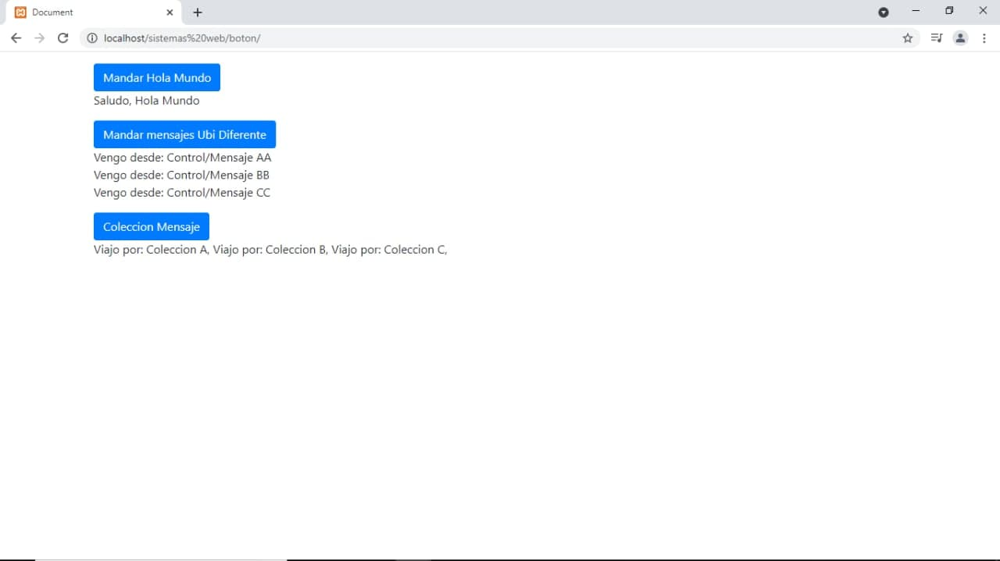

#Ejercicios
1.- Mandar Hola Mundo desde el servidor
2.- Mandar por un boton tres ajax y que nos indique de donde provienen
3.- Mandar por un boton una coleccion de informacion entre varias ubicaciones del lado servidor

